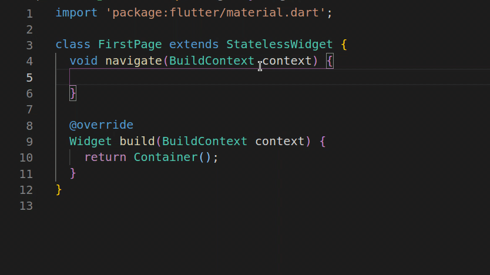

A Flutter package that will help developers to navigate through the app and authenticate their routes.

<br>

# Usage

First, add `i_navigation` as a dependency in your pubspec.yaml file.

```yaml
dependencies:
 i_navigation: 
```

Don't forget to `flutter pub get`.


Second, add the `INavigation` widget as the first widget in the tree in order to be able to access the same instance from any widget in the tree.
```dart
 class MyApp extends StatelessWidget {
  @override
  Widget build(BuildContext context) {
    return INavigation(
      child: MaterialApp(
        title: 'INavigation Demo',
        theme: ThemeData(
          primarySwatch: Colors.blue,
          visualDensity: VisualDensity.adaptivePlatformDensity,
        ),
        home: MyHomePage(title: 'INavigation Demo Home Page'),
      ),
    );
  }
 }
```
Third, add the `import 'package:i_navigations/extensions.dart';` at the beginning of the class.

Finally, type context. and you will find all the methods there.

<ul>
<li>
<a href="#available_methods">check all methods</a>
</li>
<li>
<a href="#available_widget_inputs">check all available inputs for INavigation widget</a>
</li>
</ul>


<br>


## <div id="available_methods">Available methods</div>
 ```dart
 /// can pop will return true if there are more then one page in the widget tree
 bool canPop();

 /// Pop the top-most route off the navigator
 void pop([dynamic returnedValue]);

 /// Pop all routes from navigator except first route
 void popUntilFirst();

 /// Pop all routes until finding widget that will be passed as generic type T
 /// note: generic type T must not be null and widget should stay in the tree
 void popUntilWidget<T>();

 /// Pop all routes until finding widget that will be passed as generic type T
 /// note: generic type T must not be null and widget will be popped from tree in possible(if it is not the first route)
 void popUntilWidgetIncluded<T>();

 /// Pop all routes until finding widget that will be passed as generic type T or R
 /// note: generic type T and R must not be null and widget should stay in the tree
 void popUntilOneOfTwoWidgets<T, R>();

 /// Push a new route to navigator
 /// if replacement is true the top route will be removed (as default replacement = false)
 Future<dynamic> pushRoute(Widget nextPage,{bool replacement = false})

 /// Push a new route to navigator
 /// And remove all other routes
 Future<dynamic> pushAndRemoveAll(Widget nextPage);

 /// Push a new route to navigator
 /// And remove all other routes until finding widget that will be passed as generic type T
 /// note: T must not be null and this widget should stay in the widge tree
 Future<dynamic> pushAndRemoveUntil<T>(Widget nextPage);

 /// Push a new route to navigator
 /// And remove all other routes until finding widget that will be passed as generic type T
 /// note: T must not be null and this widget will not stay in the widge tree
 Future<dynamic> pushAndRemoveUntilIncluded<T>(Widget nextPage);
 ```
<br>


## <div id="available_widget_inputs">Available widget inputs</div>

<ul>
<li>
authGuard: Is an instance of abstract class IAuthGuard which has a method routeCanPass that takes IAuthenticatedWidget as input(ie: if widget is not an instance of IAuthenticatedWidget, it will always be accessible to navigate to) and return true if user can access it, false otherwise.
</li> 
<li>
throwExceptionOnUnAuthorizedRoutes: If throwExceptionOnUnAuthorizedRoutes = true an instance of RouteNotAuthorizedException will be thrown when a non authorized route tried to be pushed.
</li>
<li>
transitionsBuilder: Transition that will be used to add the new page. The default behavior when pushing the page is from right to left, and left to right while popping.
</li>
<li>
pageBuilder: Signature for the function that builds a route's primary contents.
</li>
</ul>

#### Example
```dart
class MyApp extends StatelessWidget {
  @override
  Widget build(BuildContext context) {
    return INavigation(
      /// Provide AuthGuard that will check routes if Next Page is of type IAuthenticatedWidget routeCanPass will be triggered and it should return true so we can navigate false otherwise.
      authGuard: AuthGuard(),

      /// Set throwExceptionOnUnAuthorizedRoutes to true in order to take action if route is not authorized
      throwExceptionOnUnAuthorizedRoutes: true,

      /// override transitionsBuilder in order for the page to be appearing from bottom to top
      /// and popping from top to end
      transitionsBuilder: (c, a, s, w) {
        return SlideTransition(
          position: a.drive(
            Tween(
              begin: Offset(
                0.0,
                1.0,
              ),
              end: Offset.zero,
            ).chain(
              CurveTween(
                curve: Curves.ease,
              ),
            ),
          ),
          child: w,
        );
      },

      child: MaterialApp(
        title: 'INavigation Demo',
        theme: ThemeData(
          primarySwatch: Colors.blue,
          visualDensity: VisualDensity.adaptivePlatformDensity,
        ),
        home: MyHomePage(title: 'INavigation Demo Home Page'),
      ),
    );
  }
}
```

<br>


## To Import Extensions
You can import 'package:i_navigations/extensions.dart';<br> 
Or
<br> 
Start typing importINavigationExtension and press enter then delete it(when doing so the import will be added to the class).
<p align='center'>
  
</p>

# Acknowledgments

This package created and maintained by [Kamal Sayed](https://github.com/kamalsayed98) and [Yehya Qassim](https://github.com/yehya-qassim)

# Bugs or Requests

If you encounter any problems feel free to open an [issue](https://github.com//jonbhanson/flutter_native_splash/issues/new?template=bug_report.md). If you feel the library is missing a feature, please raise a [ticket](https://github.com//jonbhanson/flutter_native_splash/issues/new?template=feature_request.md). Pull requests are also welcome.